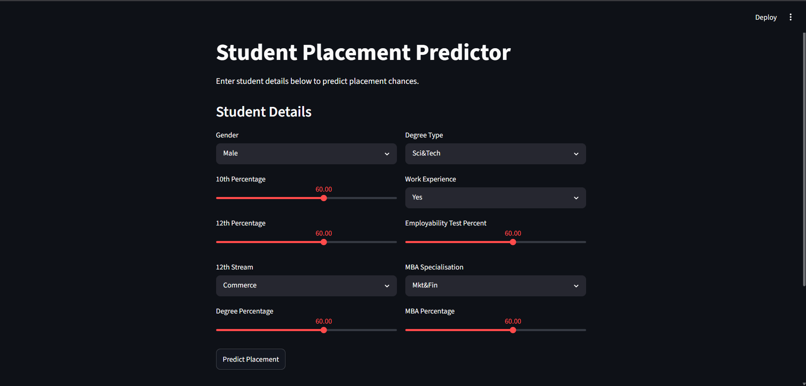

# Student Placement Analytics & Prediction System

A Machine Learning web application that predicts whether a student will get placed based on academic performance and background.

## App Screenshot


## Technologies Used
- Python
- Pandas & NumPy
- Matplotlib & Seaborn
- Scikit-Learn
- Streamlit
- Git & GitHub

## Key Findings from EDA
- Students with work experience have **86% placement rate** vs 59% without
- **10th percentage** is the strongest academic predictor of placement
- MBA percentage has very little impact on placement outcome
- Class imbalance: 68.8% Placed vs 31.2% Not Placed

## Model Performance
|       Model           | Accuracy  | Overfitting |

| Logistic Regression   | 83.72%    |   No        |
| Decision Tree         | 83.72%    |   Yes       |
| Random Forest         | 76.74%    |   Yes       |

**Best Model: Logistic Regression** — best generalization on small dataset

## How to Run

### 1. Clone the repository
```bash
git clone https://github.com/SumeetMandal2004/Placement-Predictor.git
cd Placement-Predictor
```

### 2. Create virtual environment
```bash
python -m venv venv
venv\Scripts\activate
```

### 3. Install dependencies
```bash
pip install -r requirements.txt
```

### 4. Run the app
```bash
python -m streamlit run app/app.py
```

## Project Structure
placement-predictor/
├── data/
│   ├── raw/                  ← Original dataset
│   └── processed/            ← Cleaned & prepared data
├── notebooks/                ← Jupyter notebooks
│   ├── 01_data_loading.ipynb
│   ├── 02_data_cleaning.ipynb
│   ├── 03_eda.ipynb
│   ├── 04_feature_engineering.ipynb
│   └── 05_machine_learning.ipynb
├── models/                   ← Saved ML model
├── app/                      ← Streamlit web app
│   └── app.py
├── requirements.txt
└── README.md

## Author
**Sumeet Mandal**
- GitHub: [@SumeetMandal2004](https://github.com/SumeetMandal2004)